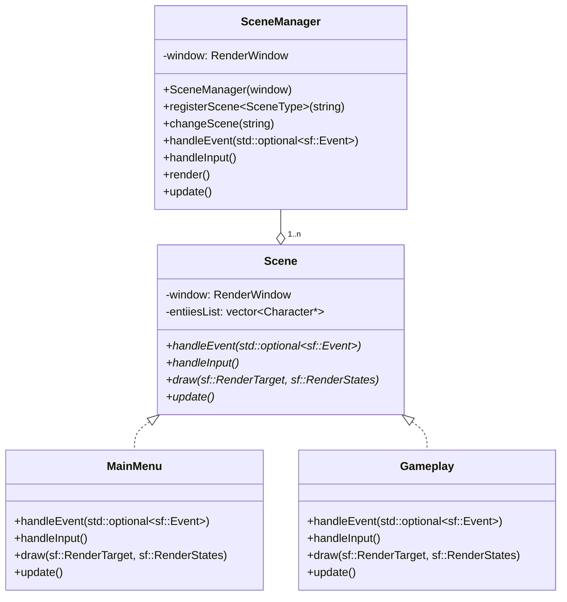
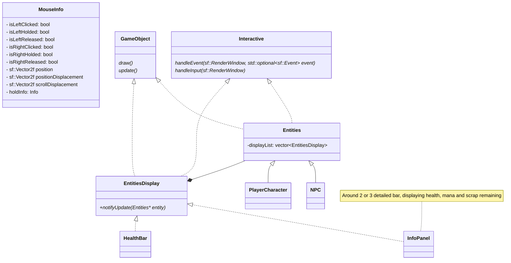

# The project's architecture

## Scene management

```mermaid
classDiagram
class SceneManager {
    -window: RenderWindow
    
    +SceneManager(window)
    +registerScene~SceneType~(string)
    +changeScene(string)

    +handleEvent(std::optional~sf::Event~)
    +handleInput()
    +render()
    +update()
}
SceneManager --o "1..n" Scene
class Scene {
    -window: RenderWindow
    -entiiesList: vector~Character*~ 
    +handleEvent(std::optional~sf::Event~)*
    +handleInput()*
    +draw(sf::RenderTarget, sf::RenderStates)*
    +update()*
}
Scene <|.. MainMenu
Scene <|.. Gameplay

class MainMenu {
    +handleEvent(std::optional~sf::Event~)
    +handleInput()
    +draw(sf::RenderTarget, sf::RenderStates)
    +update()
}
class Gameplay {
    +handleEvent(std::optional~sf::Event~)
    +handleInput()
    +draw(sf::RenderTarget, sf::RenderStates)
    +update()
}
```

## Entities

```mermaid
classDiagram

class MouseInfo {
    - isLeftClicked: bool
    - isLeftHolded: bool
    - isLeftReleased: bool

    - isRightClicked: bool
    - isRightHolded: bool
    - isRightReleased: bool

    - sf::Vector2f position
    - sf::Vector2f positionDisplacement
    - sf::Vector2f scrollDisplacement

    - holdInfo: Info

}

class Interactive {
    handleEvent(sf::RenderWindow, std::optional~sf::Event~ event)*
    handleInput(sf::RenderWindow)*
}

class GameObject {
    draw()*
    update()*

}


Interactive <|.. Entities  
GameObject  <|.. Entities  
Entities <|-- NPC
Entities <|-- PlayerCharacter
Interactive <|..  EntitiesDisplay 
GameObject <|..  EntitiesDisplay
EntitiesDisplay <|.. InfoPanel
EntitiesDisplay <|.. HealthBar
Entities --* EntitiesDisplay
class Entities {
    -displayList: vector~EntitiesDisplay~
}
class PlayerCharacter {
        
}
class EntitiesDisplay {
    +notifyUpdate(Entities* entity)*
}

note for InfoPanel "Around 2 or 3 detailed bar, displaying health, mana and scrap remaining"

```
